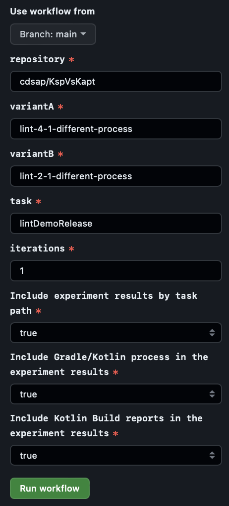
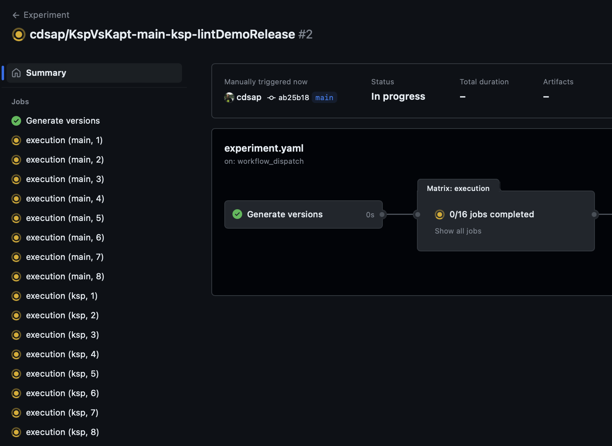
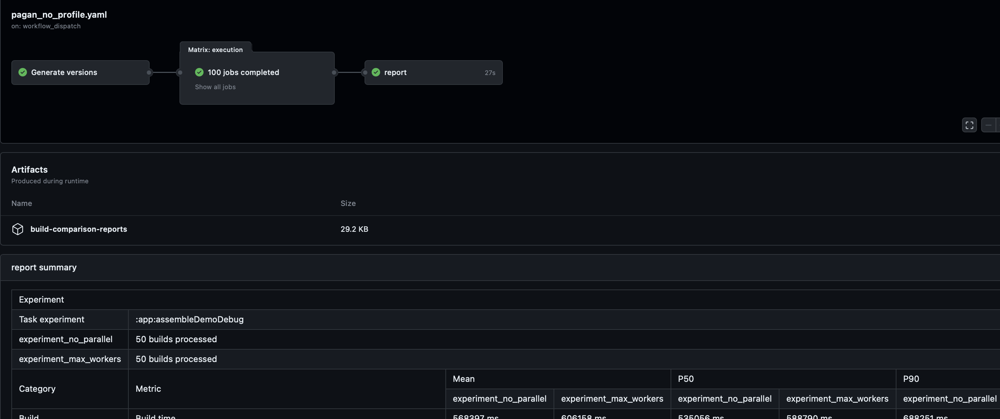
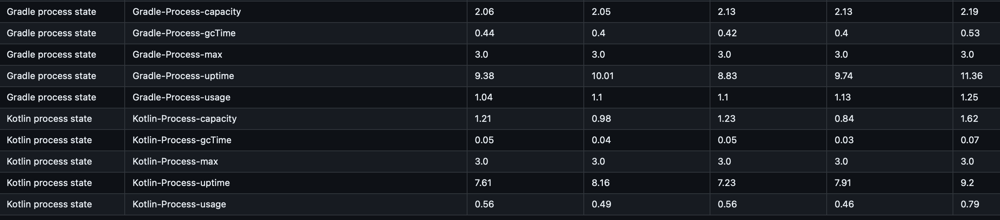
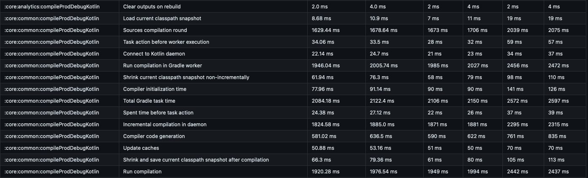

## Telltale
Sample showing how to build a functional Experimentation Framework on GitHub Actions for Gradle-Based Builds connected to Develocity.

Example:
* Experiment with Ksp in the repository nowinandroid: https://github.com/cdsap/Telltale/actions/runs/6765292564

## Usage
The repository contains `workflow_dispatch` actions that orchestrate the execution, data extraction and publication of the
results of the experiments.




The experiment is composed by two variants represented by a branch name. Given a requested task, Telltale will
execute for each variant the type of experiment with N iterations. When all the builds are finsihed it
will extract the results of the experiment and will report a summary:


## Types of experiment
Telltale supports two type of experiments:
* Default Experiments
* Experiments with Gradle Profiler

### Default Experiments
`experiment.yaml`

Each variant is executed with the action  `.github/workflows/runner`. Based on the number of iterations, it will create N
runners for each variant. For instance, for a experiment
with 8 iterations, it will create 16 jobs:



### Experiments with Gradle Profiler
`experiment-with-gradle-profiler.yaml`

Each variant is executed with the action `.github/workflows/runner-gradle-profiler`.
We can include a list of classes to apply `abi-changes` scenario in the Gradle Profiler execution.
We create two different runs, representing each variant, executing N times the requested build. The default warmpups of this
experiment is 2.

## Extracting and Publishing results
Once both variants have executed all the jobs, Telltale will execute `.github/workflows/runner`.
This action, uses the CLI [CompareGEBuilds](https://github.com/cdsap/CompareGEBuilds) that retrieves and aggregates the data
for both variants:
```
./buildsComparison --experiment-id profile-154 --variants lint-4-1 --variants lint-2-1 \
    --requested-task lintDemoRelease --api-key $GE_API \
    --url $GE_URL
```

The CLI generates a text report with the results of the experiment added as summary report of the action:


Additionally, an artifact with name `build-comparison-reports` is published with the results of the experiment in csv format:
```
type,metric,mean_experiment_no_parallel,mean_experiment_max_workers,mean_unit,p50_experiment_no_parallel,p50_experiment_max_workers,p50_unit,p90_experiment_no_parallel,p50_experiment_max_workers,p90_unit
Build,Build time,568397,606158,ms,535056,588790,ms,688251,707314,ms
Task Type,org.jetbrains.kotlin.gradle.tasks.KotlinCompile,6196,3909,ms,3943,2012,ms,16277,5391,ms
Task Type,com.google.gms.googleservices.GoogleServicesTask,41,19,ms,21,17,ms,40,30,ms
Task Type,com.android.build.gradle.tasks.MergeResources,259,204,ms,36,24,ms,763,506,ms
Task Type,com.android.build.gradle.tasks.ExtractDeepLinksTask,8,4,ms,8,4,ms,14,8,ms
Task Type,com.android.build.gradle.internal.res.ParseLibraryResourcesTask,117,56,ms,18,12,ms,42,24,ms
Task Type,com.android.build.gradle.tasks.ProcessLibraryManifest,28,16,ms,18,11,ms,32,20,ms
...
```
## Metrics
Telltale provides a report of the variants under experimentation based on the Develocity API information of the builds:
* Build duration
* Duration grouped by Task Type
* Duration by Task Path

### Gradle and Kotlin process metrics
Adding experiment metrics for each variant of the Kotlin and Gradle process.
* Gradle Process metrics
    * Requires https://github.com/cdsap/InfoGradleProcess
* Gradle Process metrics
  * Requires https://github.com/cdsap/InfoKotlinProcess



### Kotlin Build reports
Provides detailed metrics of the Kotlin compiler for each variant
* Kotlin Build Report group by metric
  * Requires https://blog.jetbrains.com/kotlin/2022/06/introducing-kotlin-build-reports/
* Kotlin Build Report group by task path
  * Requires https://blog.jetbrains.com/kotlin/2022/06/introducing-kotlin-build-reports/



## Notes
* The repository under experiment must apply the GE plugin
* After forking the repository you need to define the secrets:
  * GE_URL: Develocty URL instance
  * GRADLE_ENTERPRISE_ACCESS_KEY: Access key required to publish Build scans
  * GE_API_KEY: Token required to retrieve GE API data
* The summary of task path/type metrics provides data of cacheable tasks. If you require a complete report of the tasks independent of the cacheable state you can generate it with
  the CLI [TaskReport](https://github.com/cdsap/TaskReport):
```
./taskreport --api-key=$GE_API_KEY --url=$GE_URL --max-builds=200 --project=nowinandroid --requested-task=:core:network:packageDemoDebugAssets  \N
             --tags=profile-175_variant_experiment_big_experiment_executed_no_cache

```

## Other CI providers
Telltale uses GitHub Actions as runner component to schedule the experiments as example. You can follow the same approach in different
CI providers:
* Default Experiment
  * Based on the desired iterations, create N executions of the task under investigation for each runner in an isolated runner.
* Gradle Profiler Experiment
  * Given a Gradle profile scenario, execute each variant in a different runner
* Tag your builds with the parameters of the experiment:
```
-Dscan.tag.${{ inputs.run-id }} -Dscan.tag.${{ inputs.variant }} \
-Dscan.tag.experiment -Dscan.tag.${{inputs.experiment-id}} \
-Dscan.tag.${{inputs.experiment-id}}_variant_experiment_${{ inputs.variant }}
```
* The GECompare CLI will retrieve the results of the experiment:
```
./buildsComparison --experiment-id profile-154 --variants lint-4-1 --variants lint-2-1 \
--requested-task lintDemoRelease --api-key $GE_API \
--url $GE_URL
```
