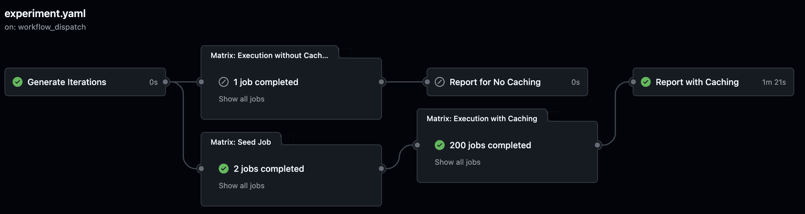
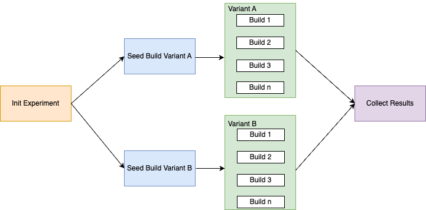
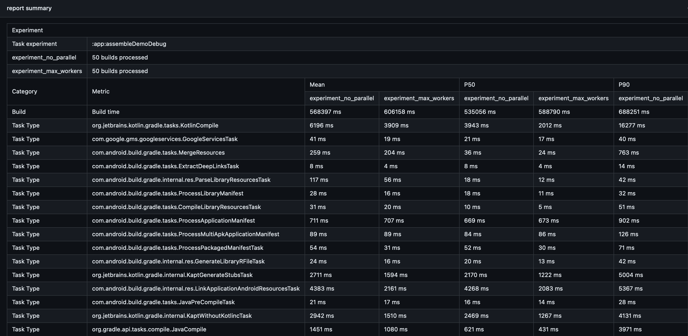

# Telltale
Telltale is an experimentation framework for Gradle builds that automates the creation of experimental environments, the execution of different experiment variants, and the visualization of experiment results.

## Table of Contents

- [Overview](#overview)
- [Workflows](#workflows)
  - [Experiment](#experiment)
  - [Experiment with Gradle Profiler](#experiment-with-gradle-profiler)
- [Setup](#setup)
- [Usage](#usage)
- [License](#license)

## Overview
This repository contains GitHub Actions workflows that serve as an experimentation framework for comparing two variants executing Gradle builds.
These workflows are designed to automate the testing and reporting of Gradle builds within different caching and execution modes. They help in understanding the performance impact of various configurations by running experiments on specified branches and comparing the results.
There are different phases in the workflow experiment execution:

## Workflows

### Experiment

This workflow executes Gradle tasks across two specified variants (branches) with different caching configurations. It helps to compare performance between different execution modes.

- **Inputs**:
  - `repository`: The GitHub repository where the experiment will run.
  - `variantA` and `variantB`: Branch names for the experiment.
  - `task`: The Gradle task to execute.
  - `iterations`: Number of iterations for each experiment run.
  - `mode`: The type of caching to apply during the experiment. 
    - **Description**: Specifies the level and type of caching used during the experiment to evaluate its impact on performance. Caching modes can be adjusted to test different scenarios including no caching, dependency caching, task caching (local or remote), and combinations with transform caches.
    - **Options**:
      - `dependencies cache`: Caches dependencies only, without caching task outputs.
      - `dependencies cache - transforms cache`: Caches dependencies, excluding transforms cache.
      - `local task cache`: Enables caching of task outputs locally.
      - `local task cache + dependencies cache`: Combines local task caching with dependency caching.
      - `local task cache - transforms cache`: Caches task outputs locally, excluding transforms.
      - `local task cache + dependencies cache - transforms cache`: Combines local task, dependency caching, and excludes transforms.
      - `remote task cache`: Uses a remote server to cache task outputs.
      - `remote task cache + dependencies cache`: Combines remote task caching with dependency caching.
      - `remote task cache - transforms cache`: Caches task outputs remotely, excluding transforms.
      - `remote task cache + dependencies cache - transforms cache`: Combines remote task, dependency caching, and excludes transforms.
      - `no caching`: Disables all forms of caching.
      
  - `os_args`: OS configurations for each variant.
    - **Description**: Defines the operating system settings for each variant, specifying which OS image to use during the workflow execution. This is useful for testing builds across different environments.
    - **Format**: A JSON string specifying the OS for each variant.
    - **Example**: `{variantA:'ubuntu-latest',variantB:'ubuntu-latest'}`

  - `java_args`: JDK versions and vendors for each variant.
    - **Description**: Specifies the Java Development Kit (JDK) versions and vendors for each variant, allowing for testing with different Java runtime environments.
    - **Format**: A JSON string with Java version and vendor settings for each variant.
    - **Example**: `{javaVersionVariantA:'17',javaVersionVariantB:'17',javaVendorVariantA:'zulu',javaVendorVariantB:'zulu'}`

  - `extra_build_args`: Additional Gradle arguments for each variant.
    - **Description**: Allows you to pass extra arguments to the Gradle command for each variant, providing flexibility to modify the build configuration as needed.
    - **Format**: A JSON string with extra arguments for each variant.
    - **Example**: `{extraArgsVariantA:'--no-daemon',extraArgsVariantB:'--no-daemon --parallel'}`

  - `extra_report_args`: Configuration for generating reports.
    - **Description**: Configures which reports to generate after the experiment, allowing you to enable or disable specific types of reports such as task path reports, process reports, Kotlin build reports, and resource usage reports.
    - **Format**: A JSON string with boolean flags for each report type.
    - **Options**:
      - `report_enabled`: Enable or disable report generation (`true` or `false`).
      - `deploy_results`: Enable or disable deployment of results in https://cdsap.github.io/Telltale/ (`true` or `false`).
      - `experiment_title`: Title for the experiment.
      - `open_ai_request`: Enable or disable OpenAI request (`true` or `false`).
      - `tasktype_report`: Include task type reports.
      - `taskpath_report`: Include task path reports.
      - `kotlin_build_report`: Include Kotlin build reports. Requires [Kotlin Build Reports](https://blog.jetbrains.com/kotlin/2022/06/introducing-kotlin-build-reports/).
      - `process_report`: Include process-related reports. Requires [InfoKotlinProcess](https://github.com/cdsap/InfoKotlinProcess) and [InfoGradleProcess](https://github.com/cdsap/InfoGradleProcess).
      - `resource_usage_report`: Include resource usage reports. Requires builds using Develocity 2024.2.
      - `gc_report`: Include garbage collection reports.
      - `only_cacheable_outcome`: Include only cacheable outcomes in the report.
      - `threshold_task_duration`: Threshold of task duration(ms) for the task path report. Default 1000.

### Experiment with Gradle Profiler

Instead of using agents based on the iterations of the experiment, Gradle Profiler experiment uses gradle-profiler to orchestrae the execution of the experiment, enabling benchmarking of build scenarios with customizable iterations and ABI changes. Generates a report based on the results.

- **Inputs**:
  - `repository`: The GitHub repository where the experiment will run.
  - `variantA` and `variantB`: Branch names for the experiment.
  - `task`: The Gradle task to execute.
  - `iterations`: Number of iterations for each experiment run.
  - `class`: Classes to apply ABI changes.      
  - `os_args`, `java_args`, `extra_build_args`, `extra_report_args`: Additional configuration options for OS, Java versions, build arguments, and report settings.

### Report
If `extra_report_args` defines `report_enabled: 'true'`, a list of reports will be generated at the end of the variant experiments. The report is generated using https://github.com/cdsap/BuildExperimentResults

## Setup

To use these workflows, ensure the following prerequisites are met:

1. Clone this repository

2. If you are using Develocity to publish the builds, add the following repository secrects in Repository:
   - `DV_ACCESS_KEY`: Access key for [Develocity](https://docs.gradle.com/develocity/gradle-plugin/current/#authenticating) access.
   - `DV_URL`: URL of the Develocity server.

3. If you want to use the CLI BuildExperimentResults, you need to add the API token access
   - `DV_API_KEY`: [API access](https://docs.gradle.com/develocity/api-manual/#access_control) key used in report generation.

## Usage

1. Trigger any of the workflows via the GitHub Actions tab in your repository.
2. Select the desired input parameters, such as branches, tasks, iterations, and caching modes.
3. Monitor the workflow's progress in the GitHub Actions logs.
4. Review generated reports and artifacts for insights into build performance and caching effects.

## License

This project is licensed under the MIT License - see the [LICENSE](LICENSE) file for details.
